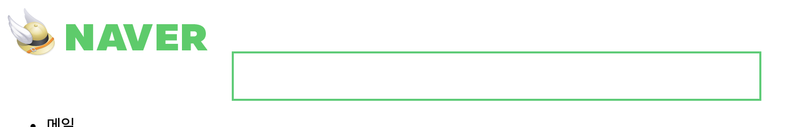
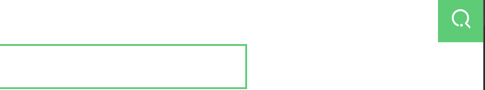
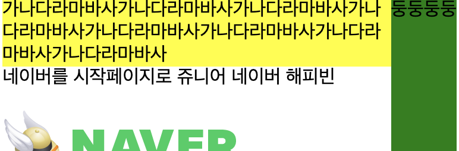
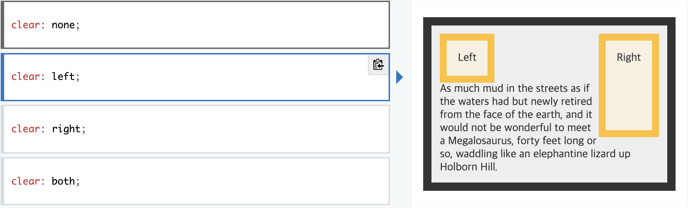

# CSS
> Cascading Style Sheet 

규칙  
* 뒤에 나오는 것이 우선순위가 더 높다. 
* important > inline style > id> class = 다른 attribute > tag element

참고 : https://caniuse.com/

## CSS 
* style tag
    ```html
    <style> 
        a{ // selector
            color: black;  // Property : Value; 
        }
    </style>
    ```
* inline 속성  
`<tag style= "속성명: 속성값; 속성명2: 속성값2;">`
    ```html
    <h1 style="colr:red"> Hello World </h1>

* .css file  
`<link rel="stylesheet" href="css파일의 경로" />`
```CSS
selector{
    속성명: 속성값;
    속성명: 속성값;
}
```
```CSS
    * {
        // 모든 태그에 적용.
    }
}
```
### class, id
tag, class, id 중에서 id를 가장 우선한다. 

* class
    ```html
    <style>
        .class_name{
            color: black;
        }
    </style>
    <body>
        <div class="class_name"></div>
    </body>
    ```
    - 축약
    ``` html
        .class_a, .class_b {

        } 
    ```
* id 
    ```html
    <style>
        #id_name{
            color: black;
        }
    </style>
    <body id="id_name">
    </body>
    ```
### 자식태그, 자손태그 
```CSS
//자식태그 
#header-search > h1 {
    //...
}
//자손태그 
#header-search h1 {
    //...
}
```

### box model
* block level element  
전체를 차지한다. 
* inline elment   
width, heigth를 설정해줄 수 있다. 
    `display:inline`  
    `display:block` 와 같은 방식으로 기본 display 속성 바꿀 수 있다.
 * inline-block  
컨텐츠만 차지한다.


### box-sizing
* border-box 
border까지 포함한 width, height. 즉, width : 100px 이면 컨텐트 영역+ padding + border 다 합친 것.

* content-box
content 영역만을 크기로 지정.  
```CSS
.class{
    box-sizing: border-box | content-box;
}
```
### padding, margin
 margin   
 border   
 padding   
 content 


 ### 단위  
* rem
    * em
    ```html
    <style>
        body{
            font-size: 10px;
        },
        div{
            font-size: 1.4em;
        }
    </style>
    <body>
        <div class="test"> Hello  <!-- 10 * 1.4 px -->
        <div class="test"> Hello </div>    
        </div> <!-- 10 * 1.4 * 1.4 px -->
        
    </body>
    ```
    `em ` 의 단위를 사용히게 되면 부모의 폰트 사이즈를 계속 상속을 받아서 하위로 내려갈수록 단위가 커지게 된다. 
    
    - rem 
    ```html
    <style>
        html{
            font-size: 10px;
        },
        div{
            font-size: 1.4rem; /* rem */
        }
    </style>
    <body>
        <div class="test"> Hello  <!-- 10 * 1.4 px -->
        <div class="test"> Hello </div>    
        </div> <!-- 10 * 1.4 px -->
        
    </body>
    ```
    rem을 사용하게 되면 root 속성(일반적으로 html)을 기준으로 하여 단위가 정해진다.
* %   
컨테이닝 블록의 % 
컨테이닝 블록 참조.  
### 색상 
* hex 표기법  
구글에 hex color 쳐보자.
* rgb 표기법  
```CSS
.class{
    border: 1px solid rgb(숫자, 숫자 , 숫자);
}
```
## Layout 잡기 

1. 가로로 구역을 나눈다. `<div>` 태그로
2. 이 후에 세로로 나눈다. 

구역 자체가 가운데 정렬일때 
```html
<div>
    <div style="margin: 0 auto"> </div>
</div>
```

### 정렬 
형제 태그끼리 height가 다르면 정렬이 달라진다. 이럴때는 형제 태그의 스타일에 
vertical-align을 바꿔주면 된다. (vertical-align은 inline, inline-block 일때만 적용이 된다.)


```CSS
    .header-search a{
        text-decoration: none;
        vertical-align: middle;
    }
    .header-search fieldset {
        /* ... */
        vertical-align: middle;
    }

```


### Position
원래 있어야하는 위치에서 옮기는 것을 position이라고 한다. 기본 값은 `static` 이다.  
```CSS 
.header-search fieldset button{
    /* ...  */
    position: absolute;
    top: 0;
    right: 0;
}
```


```CSS
.header-search fieldset {
    /* ... */
    position: relative;    
}
```

아래와 같이 부모 태그에 relative를 추가해주면 


* relative 
원래 위치에서 움직인다. 
```CSS
.class {
    position: relative;
    top : -10px;
}
```

* absolute
화면을 기준으로 위치를 옮겨간다. 
position 속성이 `absolute`인 경우 컨테이닝 블록은 `position` 속성 값이 static이 아니고(`fixed`, `absolute`, `relative`,`sticky`) 가장 가까운 조상의 내부 여백 영역이다. 즉. 부모를 계속 찾아간다. static이 아닌 부분까지 찾아간다. 없으면 html까지 올라간다.  
어딘가에 붙이고 싶으면 상위 태그에 position 속성을 고쳐준다. 위의 fieldset에 `position: relative`를 둔 것이 이 방법. 

* fixed 
position 속성이 fixed인 경우, 컨테이닝 블록은 뷰포트나 페이지 영역.  
뷰포트? 
```CSS
    position: fixed;
/*    display: inline-block;
    width: 100px;
    height: 100px;
    border 1px solid black;
    border-radius: 50px; */
```
### 컨테이닝 블록 식별


### sudo class... 어떻게 정리하지;; 너무 많다 

### Block Formatting Content
https://developer.mozilla.org/ko/docs/Web/Guide/CSS/Block_formatting_context
* float
* 인라인블록
* overlow가 visible이 아닌 요소

### float 
하나의 엘리먼트를 자신의 컨테이너의 왼쪽이나 오른쪽에 위치하도록 한다. 이 때, text나 다른 inline 엘리먼트가 자신을 감쌀 수(wrap) 있다.  
float 속성을 가진 엘리먼트는 페이지의 일반적인 흐름(`normal flow`)에서 벗어나지만, flow 자체에서 벗어나지는 않는다. 


```html
<div>
    <div style="float: right; background-color:green">
    둥둥둥둥
    </div>
    <div>가나다라마바사가나다라마바사가나다라마바사가나다라마바사가나다라마바사가나다라마바사가나다라마바사가나다라마바사
    </div>
</div>
```


```html
<div style="background-color:yellow">
    <div style="float: right; background-color:green; height: 200px;">
    둥둥둥둥
    </div>
    <div>
    가나다라마바사가나다라마바사가나다라마바사가나다라마바사가나다라마바사가나다라마바사가나다라마바사가나다라마바사
    </div>
</div>
```


### clear
엘리먼트가 선행 floating 엘리먼트 다음으로 쌓이는지 아니면 float 속성을 해제하고 그 아래로 내려가는지 지정할 수 있다. 

```CSS
clear:left;
```
