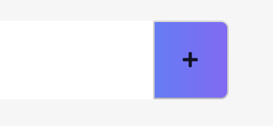

# Image Sprite

이미지 스프라이트는 하나의 이미지 파일에 여러개의 이미지 컬렉션이다. 웹페이지에 이미지가 많으면 서버에 여러번 `request`를 보내고 결과적으로 로드하는 시간이 늘어난다. 이미지 스프라이트를 사용하면 서버에 보내는 요청을 줄일 수 있다.

```CSS
#header-search h1{
    /* background-image: url('');
    background-position: 0px 0px;
    background-repeat: no-repeat; */
    background: url('') 0px 0px no-repeat;
}
```
## Button 안에 이미지 넣기 

```HTML
    <button>
        <span><span>
    </button>
```
1. `display:block | inline-block`

이 경우 `span` 태그는 `inline`태그라서 안에 `background-imgage`를 넣어도 크기가 0*0이다. 그렇기 때문에 이를 해결하기 위해서는 `span` 태그의 display 속성에 `display:block | inline-block`을 주면 해결 할 수 있다. 
```CSS
span{
    display: inline-block;
    width: 21px;
    height: 21px;
    background-position: -4px -60px;
    background-image: linear-gradient(transparent,transparent),url(https://s.pstatic.net/static/www/img/uit/2019/sp_search.svg);
    background-repeat: no-repeat;
}
```

2. `position: absolute` 
```CSS
span{
    /* display: inline-block; */
    position: absolute;
    top: 00px;
    right: 00px;
    width: 21px;
    height: 21px;
    background-position: -4px -60px;
    background-image: linear-gradient(transparent,transparent),url(https://s.pstatic.net/static/www/img/uit/2019/sp_search.svg);
    background-repeat: no-repeat;
}
```
아래와 같은 방식으로 `postion:absolute`를 주어도 해결할 수 있다. 이유는 잘 모르겠다... naver는 이런 방식을 채택하고 있다. 

cf) `button` 태그는 자체적으로 padding을 가지고 있고, 내부가 가운데 정렬이기 때문에, button 태그 사이에 들어가는 엘리먼트는 정렬이 된다. 

```HTML
<button class="confirm-container">
    <i class="fas fa-plus"></i>
</button>
```

위 코드에 `<i>` 태그는 따로 CSS가 안들어간 상태인데도 아래와 같이 가운데 정렬이 되어있다. 

## Image Replacement
웹 접근성을 준수하기 위한 필수 사항 중 하나는 이미지에 대체 텍스트를 제공하는 것입니다. 보통 HTML의  요소를 사용할 경우 alt 속성으로 대체 텍스트를 제공합니다. 특히 링크나 버튼 등의 컨트롤 요소에 이미지가 있고, 대체 텍스트를 제공해야 한다면 alt 속성이 가장 적합하다고 할 수 있습니다.


그러나 어떤 웹페이지에서 안내문을 디자인상의 이유로 일반 텍스트가 아닌 이미지로 게시해야 하는 등의 상황이 있을 수 있습니다. 또는 웹 페이지를 개발할 때 스크린리더 사용자에게 특정 이미지에 대한 추가 설명을 제공해야 할 때도 있습니다. 이렇게 이미지를 볼 수 없는 사용자에게 대체된 텍스트를 제공하는 것을 IR(Image Replacement)라고 하는데요, 이번 글에서 잘못 사용되고 있는 IR 기법의 예와 올바른 IR기법의 예를 함께 살펴보도록 하겠습니다. 아울러 스크린리더 사용자에게 이미지가 아니더라도 추가 설명을 제공해야 할 때 사용할 수 있는 방법들도 살펴보도록 하겠습니다.


Visibility: hidden과 display: none은 올바른 IR기법이 아니다
IR 기법으로 잘못 사용되고 있는 대표적인 예가 CSS 스타일의 visibility: hidden과 display: none입니다. 이 두 요소는 화면에서 적용된 요소들을 보이지 않도록 하는 공통점을 가지고 있습니다. 때문에 스크린리더 사용자를 위한 텍스트를 제공할 때 사용되는 경우를 자주 발견합니다. 그러나 이 두 스타일 속성이 적용된 요소는 스크린리더에서도 읽지 않는 것을 원칙으로 합니다.