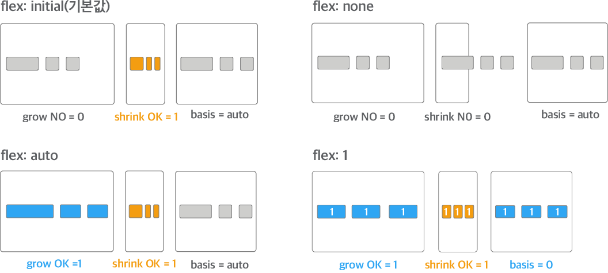
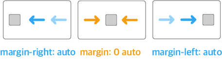
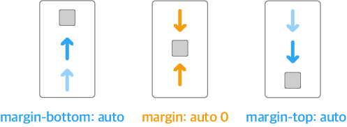
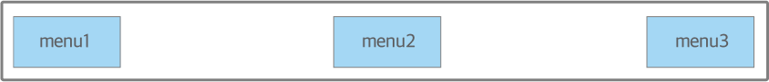
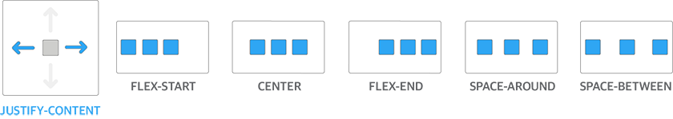
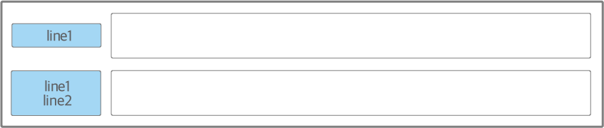
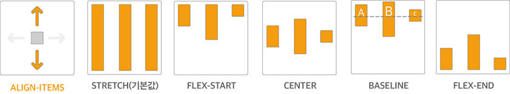

# Flex Example

- Navigation Bar
- 정렬이 다른 메뉴
  - justify-content
- 폼 레이블 수직 중앙 정렬
  - align-items
## Navigation Bar


```css
.flex-container {
  display: flex;
}

.flex-item {
  flex: none;
  /* flex: 0 0 auto */    
}

.flex-item-gnb {
  margin-left: auto;
}
```

### Flex Option



### margin-left : auto

margin-left: auto 속성으로 자식 요소를 오른쪽에 배치  

요소의 margin을 설정하는 속성에 속성값으로 auto를 적용하면 flexbox에서 flex item을 쉽게 배치할 수 있다. 예를 들어 margin: auto 속성을 적용하면 flex item의 바깥 여백이 자동으로 확장되어 flex item이 flex container의 가운데에 위치하게 된다.

flex item을 수평으로 배치할 때 다음과 같이 'auto' 속성값을 사용할 수 있다.

- margin-right: auto: `margin`이 오른쪽의 모든 공간을 차지하기 위해 flex item을 오른쪽에서 왼쪽으로 민다.
- margin: 0 auto: `margin`이 flex item을 양쪽에서 밀기 때문에 flex item이 수평 중앙에 위치한다.
- margin-left: auto: `margin`이 왼쪽의 모든 공간을 차지하기 위해 flex item을 왼쪽에서 오른쪽으로 민다.
그림


flex item을 수직으로 배치할 때 다음과 같이 'auto' 속성값을 사용할 수 있다.

- margin-bottom: auto: `margin`이 아래쪽의 모든 공간을 차지하기 위해 flex item을 아래쪽에서 위쪽으로 민다.
- margin: auto 0: `margin`이 flex item을 위아래로 밀기 때문에 flex item이 수직 중앙에 위치한다.
- margin-top: auto: `margin`이 위쪽의 모든 공간을 차지하기 위해 flex item을 위쪽에서 아래쪽으로 민다.
그림



flexbox에서 margin: auto 속성으로 레이아웃을 구현하는 방법이 핵(hack)이라고 생각하거나 버그를 일으키는 요인이 될 수도 있다고 생각할 수 있다. 하지만 margin: auto 속성은 오히려 flexbox 명세에서 권장하는 방법이다("CSS Flexible Box Layout Module Level 1"의 '8.1. Aligning with 'auto' margins' 참고). 편한 마음으로 자유롭게 사용해도 된다.


## 정렬이 다른 메뉴




### justify-content

justify-content 속성은 주축을 기준으로 flex item을 수평으로 정렬한다. 다음과 같은 5개의 속성 값으로 다양한 수평 정렬 레이아웃을 만들 수 있다.

- flex-start(기본값): 주축의 시작 부분을 기준으로 flex item을 정렬한다.
- center: 주축의 중앙을 기준으로 flex item을 정렬한다.
- flex-end: 주축의 끝부분을 기준으로 flex item을 정렬한다.
- space-around: 주축을 기준으로 flex item을 일정한 간격으로 정렬한다.
- space-between: 첫 번째와 마지막 flex item은 주축의 시작 부분과 끝부분에 정렬하고 나머지 flex item을 일정한 간격으로 정렬한다.



## 폼 레이블 수직 중앙 정렬

폼 요소의 레이블을 수직 중앙에 정렬하는 레이아웃이다. 다음 그림과 같이 한 줄짜리 텍스트뿐만 아니라 두 줄 이상의 텍스트도 수직 중앙에 정렬된다.



```css
.flex_container {
  display: flex;
  align-items: center;
}
```

폼 레이블에 해당하는 요소(.flex_container 클래스)에 align-items: center 속성을 적용한다.

### align-items 
align-items 속성은 주축을 기준으로 flex item을 수직으로 정렬한다. 다음과 같은 5개의 속성 값으로 다양한 수직 정렬 레이아웃을 만들 수 있다.

- stretch(기본값): flex item의 높이를 늘려 flex container의 전체 높이를 채운다.
- flex-start: 교차축의 시작 부분을 기준으로 flex item을 정렬한다.
- center: 교차축의 중앙을 기준으로 flex item을 정렬한다.
- baseline: 글꼴의 기준선인 baseline을 기준으로 flex item을 정렬한다.
- flex-end: 교차축의 끝부분을 기준으로 flex item을 정렬한다.
