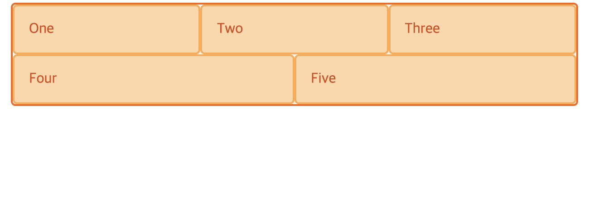

# Flex vs Grid

[Flex vs Grid mdn문서](https://developer.mozilla.org/ko/docs/Web/CSS/CSS_Grid_Layout/Relationship_of_grid_layout)  

플렉스의 경우에는 하나의 행 혹은 열로 이루어지는 레이아웃에 초점을 두고 만들어 졌다는 것이다.  

반면, 그리드는 행과 열 모두를 고려하고 만들어졌다. 

아래는 플렉스의 예시이다. 

```html
<div class="wrapper">
  <div>One</div>
  <div>Two</div>
  <div>Three</div>
  <div>Four</div>
  <div>Five</div>
</div>
```

```css
.wrapper {
  display: flex;
  flex-wrap: wrap;
}
.wrapper > div {
  flex: 1 1 200px;
// flex-grow flex-shrink flex-basis
}
```



위의 그림을 보면, Four, Five 아이템 두개가 다음 행으로 줄 바꿈을 한다. 이 두 아이템은 위의 3개의 아이템과 나란히 위치하지 하지 않는데, **이는 플렉스가 새로운 행마다 그 행이 플렉스 컨테이너가 되기 때문이다.** 그래서 공간의 분배는 가로 행이 기준이 된다.

