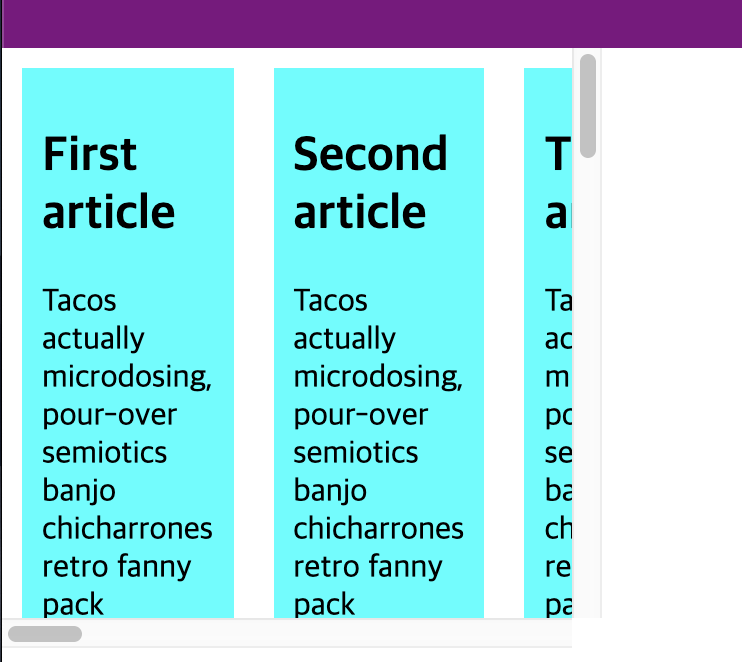

# Flex

flex는 그리드 시스템의 기반이 된다. 

- Flex container
  - flex-direction 
  - flex-wrap 
  - justify-content 
  - align-items 
  - align-content
- Flex item
  - flex 
  - flex-grow 
  - flex-shrink 
  - flex-basis 
  - order
## 기본 구조

- Container
- Item

Container와 item으로 구성이 된다. Container는 `flex box`이고 items는 그 flex box의 `elements`가 된다. 

```html
<div class="container">
    <div class="item">1</div>
    <div class="item">2</div>
    <div class="item">3</div>
</div>
```

```css
.container{
    display:flex;
    background-color: red;
}
.item{
    background-color: aqua;
    border: 1px solid white;
}
```


## flex의 방향

기본적으로 Container 내부의 elements는 왼쪽에서 오른쪽으로 방향을 가진다.

```css
.container{
    display: flex;
    flex-direction: row;  // default값
    flex-direction: column; // 위에서 아래로 진행.
}
```

## flex container

컨테이너가 가지는 기본 값.

* Items display in a row (the flex-direction property's default is row).
* The items start from the start edge of the main axis.
* The items do not stretch on the main dimension, but can shrink.
* The items will stretch to fill the size of the cross axis.
* The flex-basis:auto.
* The flex-wrap:nowrap.  
--> container를 채우고도 item이 남으면 overflow를 해버린다. 아래와 같이, 스크롤이 생기면서 튀어나간다. (이 경우에는 container가 body안의 block)


만약에 아래와 같이 div.outer(overflow: scroll)가 있을 경우에는 아래와 같다. `overflow:scroll`을 안하면 그냥 overflow 해버린다.

```html
<div class="outer">
    <div class="container">
        <div class="item"></div>
        //여러개 생략...
    </div>
</div>
```



  - flex-direction 
  - flex-wrap 
  - justify-content 
  - align-items 
  - align-content

### flex-direction 

### flex-wrap

기본적으로 container는 `flex-wrap:nowrap`이다.  
이를 `flex-wrap:wrap` 을 하게 되면 overflow하지 않고, 다음 라인으로 가게된다. 

___
**note**  
기본적으로 container 내부의 item은 container의 크기가 줄어들면 `shrink`하게 되지만, 더이상 줄어들 수 없을 때 `overflow`를 하게된다. 
___

### justify-content
### align-items
### align-content


## Flex Item


### flex-basis 

아래와 같이 최소 사이즈를 가질 수도 있다. 명세에는, 처음에 200px만큼의 공간을 부여받고, 그 이후에는 flex 비율에 따라서 나누어 가진다는 의미이다. 

```css
.item:nth-child(2){
    flex-basis:200px
}
```
**note**  
px, %와 같은 단위를 명시해야 한다.


### flex-grow  

shorthand: `flex: flex-grow flex-shrink flex-basis`  

기본적으로 아이템(elements)은 자신의 컨텐트 크기만큼의 공간을 차지한다.  
아래와 같이 `flex:1`으로 지정하게 되면, padding, margin이 정해진 후의 자신의 공간을 균일하게 가진다.

```css
.item{
    flex: 1;
}
```

여기에 아래와 같은 코드를 추가하게 되면, 2번째 child element가 다른 elements보다 2배의 크기를 가지게 된다. 정확히는 1/2/1 비율만큼을 가지게 되어 container에서 2/4 만큼을 차지하게 된다.

```css
.item:nth-child(2){
    flex:2
}
```

### flex-shrink

위의 grow property와는 반대로 줄어들때를 컨트롤 해주는 property이다. 이 속성이 정수 값으로 정해지면, item은 flex-basis 값 보다 작게 줄어들 수 있다.  
아래와 같은 아이템이 5개가 있으면, 기본적으로 200px씩 부여 받은 다음에 grow를 해서 container를 채우게 된다. 그리고 브라우저의 화면을 줄이게 되면 줄어들게 되고, flex-basis 이하로 줄어들 수 있다.   
(사실 이해가 안가는게, shrink 속성이 없어도, overflow하지 않는 선에서 줄어든다.) -> flex-shrink 속성으로 인해서 container가 item 크기보다 작아져도 overflow 없이 줄어든다.   

아마도 이 속성은, 줄어들 때의 비율을 말하는 것 같다. 아래에서 flex-basis를 400px로 조정하면 5개의 아이템 모두가 400px를 못채워서 사이즈를 줄이게 되는데, 이때 줄어드는 사이즈의 비율이 `flex-shrik` 속성에 의해서 줄어든다. 

```css
.item {
    padding: 10px;
    margin: 10px;
    background: aqua;
    flex-shrink:1;
    flex-grow:1;
    flex-basis:200px;
}
.item:nth-child(3){
    flex-shrink:2;
}
```

## Alignment, justification and distribution of free space between items 
https://developer.mozilla.org/en-US/docs/Web/CSS/CSS_Flexible_Box_Layout/Basic_Concepts_of_Flexbox