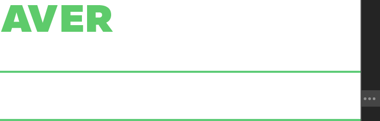

# Layout

1. 우선적으로 가로로 레이아웃을 나눈다.  

```HTML
<header></header>
<main></main>
<footer></footer>
```

2. 이후 세로로 나눈다.


## Display

HTML 엘리먼트는 모두 Display 속성을 갖는다. 대부분은 `inline` or `block`

### Display 속성의 종류 

* block : 하나의 줄을 가득 채운다. `div` `p` `form` `header` 
* inline : 컨텐츠를 감싼다. `span` `a`
* inline-block : 
* flex :
* none :

## 수평 정렬  
특정 엘리먼트를 중앙 정렬하려면 아래와 같이 코드를 작성하면 된다. 

```html
<div class="center"></div>
```

```CSS 
.center{
    width:1080px;
    margin: 0 auto; /* 아래 위 마진 0 좌우 마진 자동 */ 
}
```


```CSS
.center {
  max-width: 1080px;
  margin: 0 auto;
}
</style>
```


위는 width 아래는 max-width

## box layout 

엘리먼트는 `margin`, `border`, `padding` 와 같은 넓이가 추가로 붙는다. 

```CSS
.class {
  width: 500px;
  padding: 20px;
}
``` 
즉 위와 같은 경우의 엘리먼트는 총 520px를 가지게 된다.

```CSS
* {
  box-sizing: border-box;
}
```

위와 같이 border-box로 설정을 하면 이전의 엘리먼트는 총 500px를 가지게 되어, `border`, `padding` 의 값을 따로 계산하지 않아도 된다.
