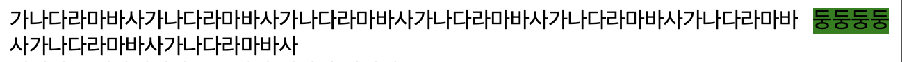

# Positioning

## Position  

포지션 속성은 엘리먼트가 페이지 어디에 위치할 것인지를 결정하는 속성. 기본 값은 `static`이다.

* `static` : 기본 값.
* `fixed` : 고정된 화면을 기준으로 위치가 지정된다. 페이지가 스크롤, 확대, 축소되어도 같은 위치에 존재한다. 구글의 검색창.  
* `absolute` : 상위의 가장 근접한 엘리먼트를 기준으로 `fixed`와 같이 위치가 설정된다.  position 속성이 `absolute`인 경우 컨테이닝 블록은 `position` 속성 값이 static이 아닌(`fixed`, `absolute`, `relative`,`sticky`) 가장 가까운 조상의 내부 여백 영역이다. 즉. 부모를 계속 찾아간다. static이 아닌 부분까지 찾아간다. 없으면 html까지 올라간다.  
어딘가에 붙이고 싶으면 상위 태그에 position 속성을 고쳐준다.  
* `relative` : 랠러티브(relative)는 top, right, left, bottom과 같은 속성을 주지 않으면 스태틱과 동일하게 위치합니다. 만약 top: -20px; left: 20px과 같은 속성을 주면 위로 20px 왼쪽으로 20px 떨어진 곳에 엘리먼트가 위치하게 됩니다. 이때 생성된 간격은 다음 엘리먼트의 위치에 영향을 주지 않습니다.

```CSS 
.header-search fieldset button{
    /* ...  */
    position: absolute;
    top: 0;
    right: 0;
}
```


```CSS
.header-search fieldset {
    /* ... */
    position: relative;    
}
```

아래와 같이 부모 태그에 relative를 추가해주면 


* relative 
원래 위치에서 움직인다. 

```CSS
.class {
    position: relative;
    top : -10px;
}
```

## Float

하나의 엘리먼트를 자신의 컨테이너의 왼쪽이나 오른쪽에 위치하도록 한다. 이 때, text나 다른 inline 엘리먼트가 자신을 감쌀 수(wrap) 있다.  
float 속성을 가진 엘리먼트는 페이지의 일반적인 흐름(`normal flow`)에서 벗어나지만, flow 자체에서 벗어나지는 않는다. 


```html
<div>
    <div style="float: right; background-color:green">
    둥둥둥둥
    </div>
    <div>가나다라마바사가나다라마바사가나다라마바사가나다라마바사가나다라마바사가나다라마바사가나다라마바사가나다라마바사
    </div>
</div>
```



```html
<div style="background-color:yellow">
    <div style="float: right; background-color:green; height: 200px;">
    둥둥둥둥
    </div>
    <div>
    가나다라마바사가나다라마바사가나다라마바사가나다라마바사가나다라마바사가나다라마바사가나다라마바사가나다라마바사
    </div>
</div>
```


### clear
엘리먼트가 선행 floating 엘리먼트 다음으로 쌓이는지 아니면 float 속성을 해제하고 그 아래로 내려가는지 지정할 수 있다. 

```CSS
clear:left;
```

## z-index

HTML은 2차원이 아니라 3차원이다. 그 3차원 축이 z축이고 이를 `z-index`로 조절할 수 있다. 

1. z-index가 없는 경우의 쌓임  
HTML의 순서대로 쌓인다. 하지만 `position` 속성을 가진 경우에는 다른 엘리먼트보다 위로 쌓이게 된다. position 속성을 가진 엘리먼트는 html의 순서대로 쌓인다. 
2. floating 엘리먼트의 쌓임  
일반 엘리먼트/ floating/ position 이런 층계로 쌓이게 된다.

### 쌓임 맥락

