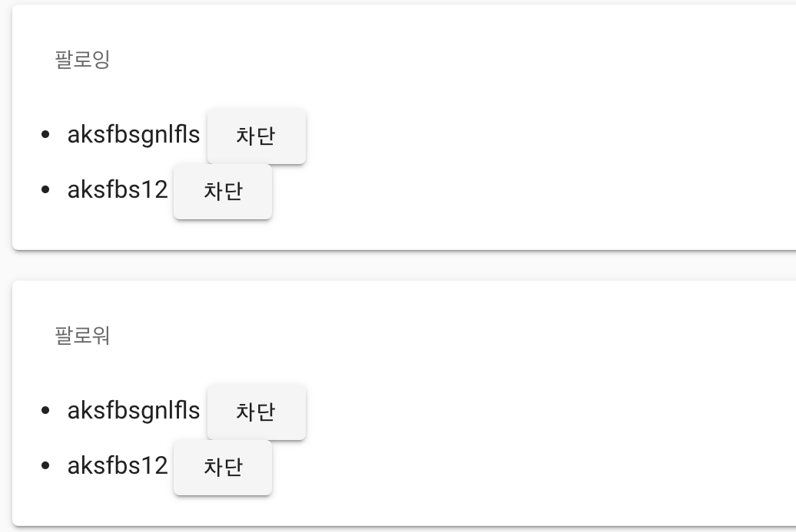

# tips

## 반복되는 컴포넌트

모양은 같은데 데이터만 다른 컴포넌트 두개르 만들때, 두개의 파일을 만들지 않는법.  
`props`를 넘겨주면 된다. 

```html
<v-container>
    <v-subheader>팔로잉</v-subheader>
    <follow-list :users="followingList" :remove="removeFollowing"/>
</v-container>
</v-card>
<v-card style="margin-bottom: 20px">
<v-container>
    <v-subheader>팔로워</v-subheader>
    <follow-list :users="followerList" :remove="removeFollower"/>
</v-container>
```

위에는 `follow-list`라는 하나의 컴포넌트만을 사용한다. 하지만, `props`를 통해서 이를 구분.

```js
  computed:{
    followerList(){
      return this.$store.state.users.followerList;
    },
     followingList(){
      return this.$store.state.users.followingList;
    }
  },
  methods:{
    removeFollower(payload){
            this.$store.dispatch('users/removeFollower', payload);
    },
    removeFollowing(payload){
        console.log(payload);
        // console.log("팔로워");
        this.$store.dispatch('users/removeFollowing',payload);
    }
  },
```

아래의 follow-list는 이것을 받아 데이터를 뿌려주면 된다. 


## virtualized list 

--> 따로 알아보기
vue virtual scroll list 

## infinite scrolling

window.scrollY + document.documentElement.clientHeight 
=== document.documentElement.scrollHeight


## pagenation 

## scroll behavior