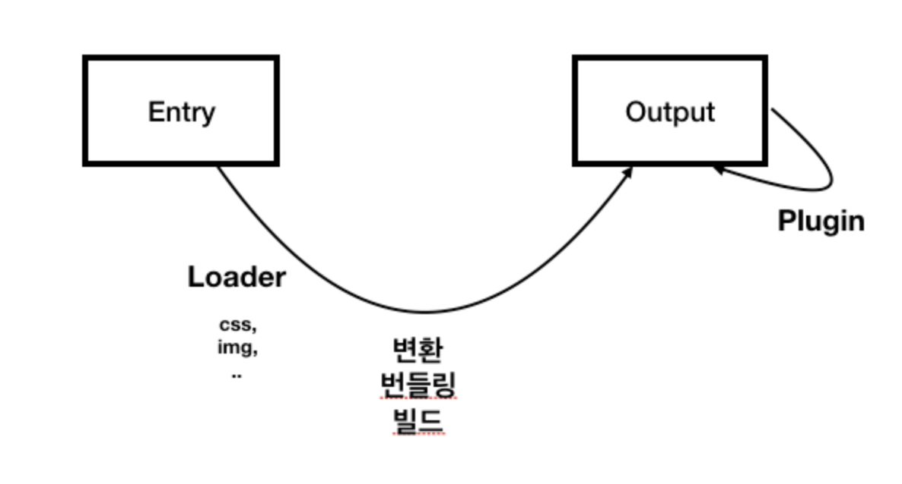

# Webpck

웹팩이란 최신 프런트엔드 프레임워크에서 가장 많이 사용되는 모듈 번들러(Module Bundler)입니다. 모듈 번들러란 웹 애플리케이션을 구성하는 자원(HTML, CSS, Javscript, Images 등)을 모두 각각의 모듈로 보고 이를 조합해서 병합된 하나의 결과물을 만드는 도구를 의미합니다. 그럼 모듈과 모듈 번들링에 대해서 조금 더 살펴보겠습니다.


## 기본 구조

```bash
mkdir webpack-demo
cd webpack-demo
npm init -y
npm install webpack webpack-cli --save-dev
```

project

```bash
  webpack-demo
  |- package.json
  |- webpack.config.js
  |- /dist
    |- index.html
  |- /src
    |- index.js
```

webpack.config.js

```javascript
const path = require('path');

module.exports = {
  entry: './src/index.js',
  output: {
    filename: 'main.js',
    path: path.resolve(__dirname, 'dist'),
  },
};
```

## Basic Concepts



1. Entry
2. Ouput
3. Loader
4. Plugin
5. Resolve


## Entry

## config

* webpack --watch 

```javascript
"scripts": {
    "test": "echo \"Error: no test specified\" && exit 1",
    "build": "webpack --watch"
  },
```

* webpack-dev-server 

npm i -D webpack-dev-server

```javascript
//package.json
"scripts": {
    "build": "webpack --watch",
    "dev": "webpack-dev-server --hot"
  },
```

```javascript
//webpack.config.js
output:{
        filename : 'app.js',
        path : path.join(__dirname, '/dist'),
        publicPath: '/dist'
    }
```